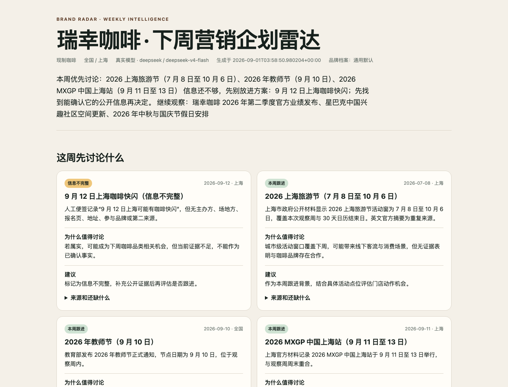
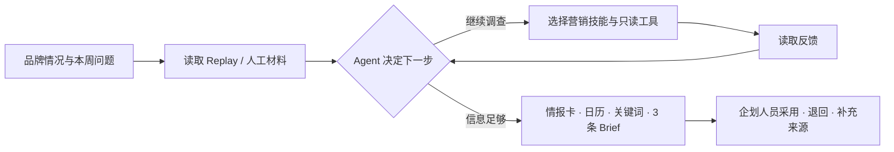
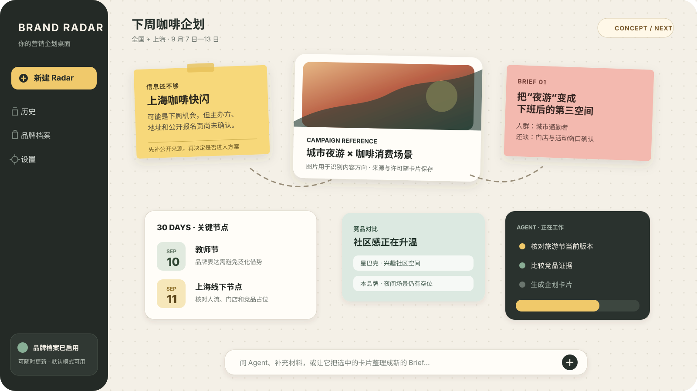

<h1 align="center">Brand Radar</h1>

<p align="center"><strong>把分散的市场信号，变成符合品牌判断的下一步企划。</strong></p>

<p align="center">品牌上下文 · 目标驱动调查 · 营销技能 · 来源可追溯 · 人工决定</p>



<p align="center"><sub>当前真实 Demo：DeepSeek 模型读取咖啡 Replay 材料后生成的本地周会稿。截图不包含 API Key、本机路径或原始运行文件。</sub></p>

> [!IMPORTANT]
> Brand Radar 当前是一套可以真实运行的品牌营销单 Agent 骨架，不是实时监测平台，也还没有无限画布 GUI。上图是当前真实结果；下文的企划桌面图明确属于下一阶段方向。

## 为什么做 Brand Radar

营销企划通常不是缺信息，而是被信息拖住：同一事件被反复转载，新旧版本混在一起，热点很热却不适合品牌，最后的 Brief 又找不到可靠依据。

Brand Radar 希望成为企划人员的调查搭档：先理解这次品牌和目标，再阅读材料、排除噪音、选择必要的查证动作，把值得讨论的信号变成情报卡、时间节点和不同方向的 Brief，最后交给人采用、退回或继续补充。

## 它怎样工作



这不是一次性生成固定 JSON。真实模型会在每轮根据品牌、目标、材料和已有反馈，选择继续调查还是开始成稿；程序负责来源、引用、轮次和结果保存等稳定规则。

## 当前已经能做什么

| 能力 | 当前表现 |
|---|---|
| 品牌上下文 | 可使用通用 `BRAND.md`；首次使用也可通过六个简短问题补充品牌情况，全部跳过则继续使用默认档案 |
| 单 Agent 循环 | 观察材料 → 选择一项营销技能与调查动作 → 读取反馈 → 继续或成稿 |
| 营销技能 | 信号筛选、品牌契合、Brief 转译三项本地 Skills |
| 调查工具 | 检查材料、比较版本、对比竞品证据、核对冲突，全部为本地只读动作 |
| 企划结果 | 情报卡、未来 30 天关键节点、关键词、3 条不同 Brief、本地 HTML 周会稿 |
| 来源约束 | 区分候选、实际使用和有冲突的来源；Brief 只能引用已存在的情报卡 |
| 失败行为 | 错误 Key 明确失败，不降级 Mock；校验失败不留下伪成功结果 |
| 人工控制 | 最终停在人工复核，不发送、不发布、不投放、不修改预算 |

### 营销特化不只是一个 Prompt

- `agent/AGENTS.md` 固定品牌优先、营销目标驱动和人工决定的工作方式。
- `BRAND.md` 提供品牌长期上下文，但品牌建档只是普通首次使用设置，不是产品主流程。
- Agent 按当前缺口选择营销技能，不把所有能力塞进一次大提示词。
- 卡片同时回答“发生了什么、为什么值得进企划会、是否适合品牌、依据在哪里、还缺什么”。
- 三条 Brief 必须从不同人群、场景、时机或竞品空位出发，不能只换标题。

## 真实 Demo

默认演示场景：为“瑞幸咖啡 / 现制咖啡 / 全国 + 上海”准备下一周营销企划观察。

当前真实 DeepSeek `deepseek-v4-flash` 运行结果：

- 4 轮 Agent 决定，执行 3 个本地调查动作后开始成稿；
- 生成 7 张情报卡和 3 条不同 Brief；
- JSON 与 HTML 来自同一次已校验结果；
- 最终状态为 `awaiting_human_review`，外部动作数量为 0；
- 错误 Key 明确失败且没有新增结果文件；
- 当前自动化测试共 100 项。

Replay 材料让演示可稳定复现，但不代表实时监测结果。真实模型负责判断与生成；Mock 只用于无 Key 时检查程序链路，不能作为业务演示证据。

## 快速开始

### 1. 准备本地环境

```bash
python3 -m venv .venv

.venv/bin/python -m pip install \
  "openai>=1.30.0" "httpx>=0.27.0" "pydantic>=2.0.0" \
  "python-dotenv>=1.0.0" "rich>=13.0.0"

cp .env.example .env
```

在本机 `.env` 中选择 Provider、模型并填入对应 API Key。不要把 Key 写进命令、截图、Issue 或 Git 提交。

### 2. 可选：补充品牌情况

```bash
.venv/bin/python run.py --brand-setup
```

可以逐题回答或跳过。关闭、全部跳过或暂时不建档时，系统使用仓库通用 `BRAND.md`。

### 3. 使用真实模型运行周企划

```bash
.venv/bin/python run.py --weekly \
  --source-pack data/replay/coffee-week-2026-09-07/manifest.json \
  --require-api
```

成功后终端会显示 JSON 和 HTML 周会稿位置，并提示等待人工复核。`--require-api` 会让缺 Key、错误 Key 或模型失败明确停止，绝不静默切换到 Mock。

### 4. 运行测试

```bash
.venv/bin/python -m unittest discover -s tests -p 'test_*.py'
```

如果默认安装源卡住，可以切换可用的镜像源；不要为了旧探索工具一直等待无进展的安装。

## 下一阶段：企划人员的桌面



<p align="center"><sub>方向概念，并非当前产品截图。最终界面将在 Agent 主链与图文结果结构稳定后开发。</sub></p>

未来 GUI 会保留左侧“新建、历史、品牌档案、设置”，右侧是一张有边界的无限画布：企划人员可以摆放情报便利贴、图片、视频预览、来源、竞品对比、日历和 Brief，像整理自己的办公桌一样组织一次调查。

实用性优先于动效：

- Agent 先把内容放进“本周重点、待核、竞品、日历、Brief”等有限 frame，避免无限空间变成垃圾场。
- 便利贴可以有轻微弹性、倾斜和聚焦动效，但不会持续晃动，并支持减少动态效果。
- 画布只优先渲染当前视口；大图使用缩略图，视频不自动播放，离屏媒体延迟加载。
- 提供回到重点、缩放到全部、搜索、筛选和一键整理。
- 图片和视频必须保留来源及使用状态；没有合适素材时，宁可使用清楚的文字卡。

这一方向只吸收 Cowart 的无限画布、媒体占位和本地项目资源组织思路，不复制其代码、界面或视觉资产。

## 当前与下一步

| 阶段 | 状态 | 重点 |
|---|---|---|
| 可运行骨架 | 已完成 | 真实模型、Replay、营销技能、调查反馈、专用校验、HTML 周会稿 |
| 完整营销 Agent | 下一轮 | 任务历史、人的采用 / 退回记忆、定制品牌差异、更加丰富的图文回答 |
| 企划桌面 GUI | 后续 | 左侧基础导航、右侧可控无限画布、便利贴与多媒体组件 |
| 更丰富来源 | 按真实需要增加 | 公开网页、用户文件、图片与视频预览；始终保留来源与权限状态 |

## 数据与安全

- `.env`、API Key、Cookie、`memory/brand/BRAND.md`、`outputs/`、虚拟环境和本机日志不会进入 Git。
- 公开仓库中的 Demo 截图只包含 Replay 场景的页面内容，不包含浏览器地址栏、本机路径或原始运行文件。
- 缺 Key 时可主动使用已标记的 Mock 检查程序；真实模式失败不能伪装成成功。
- 默认流程没有发送、发布、投放、预算修改或其他外部写入工具。
- Replay、公开来源、人工摘录和模型判断在结果中分开记录。
- 本仓库目前尚未声明开源许可证；在许可证确定前，不擅自对外承诺授权范围。

## 项目结构

```text
BRAND.md                    通用品牌上下文
agent/AGENTS.md             Brand Radar 运行规则
skills/brand-radar/         三项营销 Skills
data/replay/                可复查的咖啡观察包
scenarios/brand_radar_weekly.py
                             周企划场景与本地调查工具
framework/                  模型接入、Agent 循环、结果与报告
run.py                      品牌设置与 weekly 入口
tests/                      当前回归测试
```

`v1_basic/`、`v2_structured/`、`v3_agent/` 和部分旧场景是早期探索资产，不是当前默认产品入口。

## 文档

- [产品需求](docs/product/PRD.md)
- [产品路线图](docs/product/ROADMAP.md)
- [下周营销企划工作流](docs/business/NEXT-WEEK-WORKFLOW.md)
- [Agent 打造说明](docs/product/AGENT-BUILD.md)
- [当前项目状态](docs/PROJECT-STATE.md)

## 参考与原创边界

业务工作方法参考 [RealReplicaBench 官方仓库固定版本](https://github.com/Accio-Lab/RealReplicaBench/tree/4041872837eb960a16bbe3d73b459f20680b8ad6)，只吸收版本核对、材料交叉确认、来源追溯和人工复核等可迁移原则。Brand Radar 的咖啡场景、品牌上下文、营销技能、周会稿和企划桌面方向均为本项目自己的业务转译。
