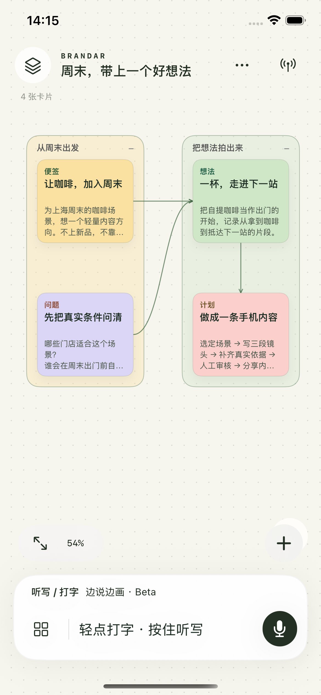
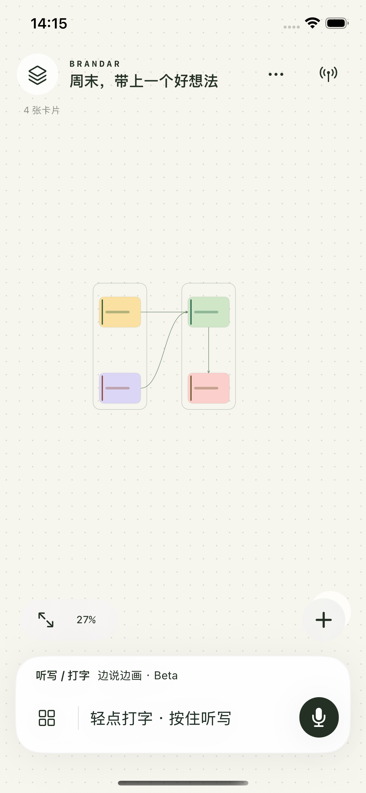
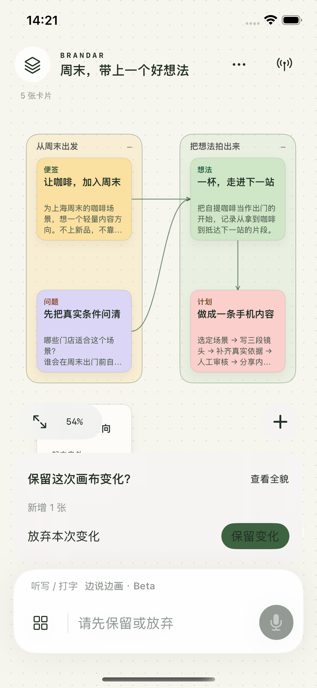

<h1 align="center">Brandar</h1>
<p align="center"><strong>随心画板，AI 帮你落笔。</strong></p>
<p align="center">Brandar · 一块可以边聊边改的无限画布</p>

<p align="center">
  
  
  
</p>
<p align="center"><sub>原生 iPhone App 模拟器实拍 · 示例内容</sub></p>

<p align="center">
  
  
</p>
<p align="center"><sub>全貌与 Beta 确认均为隔离的模拟器测试画面；不代表真人语音已完成验收。</sub></p>

**先把想法放下来，再把关系连起来。** 日常使用 Brief 生成和修改画布；开启「边说边画 · Beta」，口述中的结构会逐步出现，松手后选择保留或放弃。文字、图片、手绘、清单和表格，都能放回它们所属的关系里。

选中卡片或分组继续聊，AI 在原处改稿。完整阅读页、变化定位、按轮撤回、画布搜索和阅读稿导出，让同一份想法能继续用下去。[当前路线](docs/product/MOBILE-CANVAS-PLAN.md)。

**[认识移动端 →](docs/mobile/README.md)**　[用 Xcode 安装](ios/README.md)　[验收记录](ios/docs/REALTIME-ACCEPTANCE.md)

原生 SwiftUI / UIKit，无需注册，本机保存；通过配置的 Agent API 整理内容。已提供个人 TestFlight 内测，尚未公开上架 App Store。网页企划桌面继续保留，支持公开资料调查和多轮共同改稿。

## 好企划，往往从一句“等一下”开始

读了很多材料，最有价值的时刻可能是：“这个大家都在讲，但跟我们有什么关系？”也可能是：“这一小段很有意思，能不能沿着它再想想？”

Brandar 把资料、观察和正在形成的创意放在同一张桌面上。它可以沿着问题找新依据，也可以放下牵强的方向。你圈中一张卡，告诉它哪里不对，它继续改这份作品。

不必每次生成一份完整周报，也不必为了交差凑齐三个想法。

## 桌面端：调查与共同改稿


<sub>网页 Demo 实拍。图中作品经过真实模型调查、多轮反馈与直接改稿。</sub>

| 调查 | 一起推敲 |
|---|---|
| 放入公开链接、文字摘录或文本文件 | 选中一张或几张卡，围绕它们追问 |
| Agent 按需要查找网页、读原文与比较材料 | 直接修改、保留或放下一个方向 |
| 区分观察、创意假说、来源和待解问题 | 拖动、缩放、整理与聚焦作品 |
| 展开相关依据和来源图像 | 从历史继续，导出当前工作稿 |

每次企划都留在本机。来源、对话、卡片位置与修改前的稿子一起保存；模型失败或你主动停止时，已经完成的内容仍然在。

## 从一个真实的问题开始

**上海周末，咖啡该出现在什么时候？**

我们准备了四份实际阅读过的公开材料：瑞幸的品牌与自提模式、上海的城市漫步路线、星巴克的兴趣社区服务。你可以用它们为瑞幸探索一个轻量内容方向——不上新品、不打折，也不要求门店适合久坐。

这是独立研究命题，材料附原始出处和日期，创意由真实模型当次生成。历史路线是空间参考，具体门店与当前开放情况仍需要继续查证。

开始后，可以试着对某个方向说：

> 保留这个角度，但别做成城市攻略。让咖啡在其中承担一个具体作用。

## 它怎样越来越懂这个品牌

品牌档案记住真实条件、有原因的好坏例子和值得坚持的取舍。当前任务里的反馈先改变当前作品；只有你主动保存品牌底稿，才写入长期品牌资料。

我们也用真实作品和人的修改继续打磨它：资料太薄就改善取材，判断太泛就补品牌案例，改稿没改到做法就改善工作方法。

## 继续打磨日常会打开的画布

想做成的体验很简单：打开 App，就是上次还没想完的那张桌面。放进新材料，接着聊几句，把一条观察推进成有表达、有具体做法的企划。品牌的取舍和做过的作品，也在一次次合作中积累。

原生移动端已加入这个方向。接下来继续用真实企划检验整理和改稿能力，打磨连续口述与触摸操作。网页端继续作为另一种入口，具体上线时间不预设。

详见 [Roadmap：从网页 Demo 到企划 App](docs/product/ROADMAP.md)。

## 在本地运行 Demo

需要 Python 3.11+、Node.js 20.19+，以及一个真实模型 API Key。

```bash
python3 -m venv .venv
.venv/bin/python -m pip install -r requirements.txt
cd web
npm ci
npm run build
cd ..
cp -n .env.example .env
```

在 `.env` 中填写模型服务和 Key（已有配置时保留原文件），然后运行：

```bash
.venv/bin/python run.py --studio
```

服务启动后，打开 **[本地企划桌面](http://127.0.0.1:8765)**，选择研究起点或新建自己的问题。没有 Key 也能打开桌面；调查和改稿需要真实模型，不会悄悄切换成模拟结果。

品牌资料、任务和 Key 留在本机，不随 Git 上传。外部图片用于研究参考，保留出处；使用前仍需确认适用的使用条件。桌面不自动发消息、发布、投放或调整预算。

## 项目结构

| 目录 | 内容 |
|---|---|
| `studio/`、`web/` | 当前 Agent 和网页 Demo |
| `ios/` | 原生 iPhone 无限画布、对话与语音输入 |
| `agent/`、`skills/` | Agent 的工作方法与营销技能 |
| `data/` | 公开研究案例与历史 Replay 材料 |
| `framework/` | 模型接入、品牌资料与旧 CLI 支持 |
| `scenarios/` | 保留兼容的历史场景与可选依赖 |
| `docs/`、`tests/` | 当前产品说明与相关测试 |

旧版本实验、过期计划与概念图已从当前目录移除，需要时可以查阅 Git 历史。

## 进一步了解

当前桌面、Agent 结构和开发方式见 [Agent 打造说明](docs/product/AGENT-BUILD.md)。原有 `--weekly` 咖啡 Replay 周会稿保留为历史回放入口；它不是实时市场监测。

- [产品愿景与使用方式](docs/product/PRD.md)
- [一次企划怎样推进](docs/product/WORKFLOW.md)
- [继续打造的方向](docs/product/ROADMAP.md)
- [当前状态](docs/PROJECT-STATE.md)
