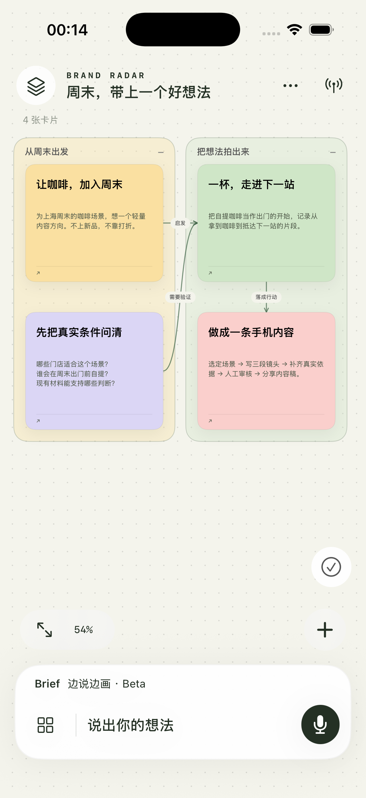
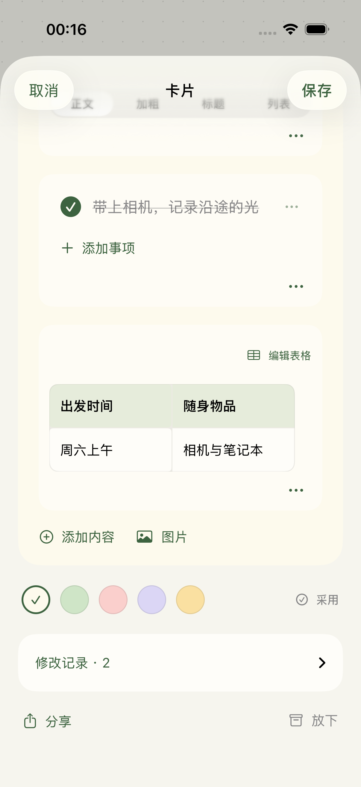
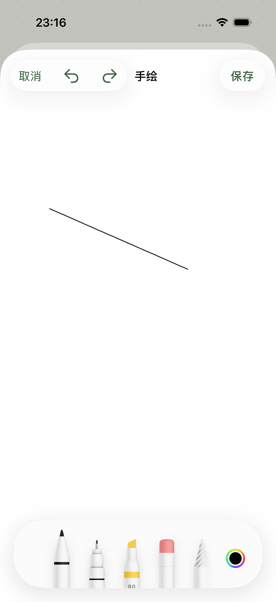

<h1 align="center">Brand Radar Mobile</h1>

<strong>把想法说出来，看见它长成一张图。</strong>

边说边成图 · 素材留在身边 · 随时接着改

  
  
  

原生 App 模拟器实拍，展示示例内容。画布、内容编辑和手绘均为可交互界面。

## 一句话，可以有很多条路

“周末活动分成店内和户外两个方向，两边共用一份物料。”

日常入口是 Brief：按住底部的「说出你的想法」口述，或短按打字，生成并继续修改同一张画布。

想看结构边听边形成，可以切换「边说边画 · Beta」。独立聆听区显示转写及新增、修改、删除数量；松手补完后，检查画布再选择保留或放弃。上滑取消本段；保留后仍能整段撤销。

AI 默认整理你的表达；明确要求时，再一起展开新的可能。

## 想法有结构，素材有位置

照片、手绘、文字、清单和表格可以放在同一张卡片里。内容太多，就拆成新的节点，再连回原来的关系。点开看细节，收起看全貌。清单直接勾选，点文字才编辑；表格有清晰表头，点单元格修改。

| 想做什么 | 在手机上怎么做 |
|---|---|
| 看清结构 | 拖放、缩放、分支连线、嵌套分组与折叠 |
| 继续调整 | 选中对象改标题、改尺寸；多选、复制、分组；撤销与重做 |
| 把草图整理出来 | 选择图片或手绘，交给 AI 转为可编辑结构，保留原稿对照 |
| 装下完整材料 | 文字、照片、手绘、清单、表格、链接、文件与音视频 |
| 把结果带走 | 导出 PNG、PDF，或带附件的可编辑画布包 |

手绘使用 PencilKit；文件预览、播放和分享复用系统组件。画布保存在本机，无需注册账号。AI 使用你配置的 API，Key 单独保存在设备 Keychain。

“我想做一个电影的几段式剧本”会按三幕组织；“生成三张卡片”会检查新增数量。模板规范落实到结构里，不额外塞进说明卡。

## 轻一点，随手打开

原生 SwiftUI / UIKit，最低 iOS 17，没有第三方 Swift 依赖，也不打包本地大模型。签名应用约 **2 MB**，画布和附件按实际使用另计。

**[打开 iPhone 工程与安装说明](../../ios/README.md)** · **[查看源码](../../ios/BrandRadar)** · **[查看本轮验收范围](../../ios/docs/REALTIME-ACCEPTANCE.md)**

这是公开开发中的源码预览版，尚未上架 App Store。真实 DeepSeek 流式图片测试已逐项核对 5 个节点、5 条关系，首批约 3.6 秒；这一数字来自指定测试任务，并非速度承诺。设备安装与绘制测量记录见验收页；超过一分钟的真人连续口述仍待验收。会议听录、多人协作和外部业务系统连接不在本轮范围内。
