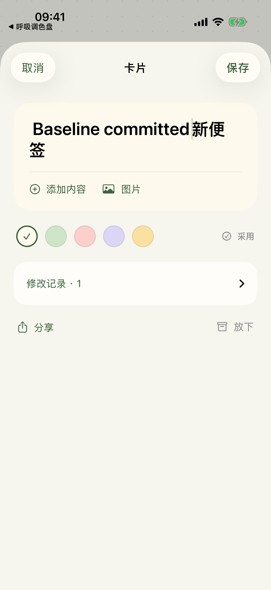
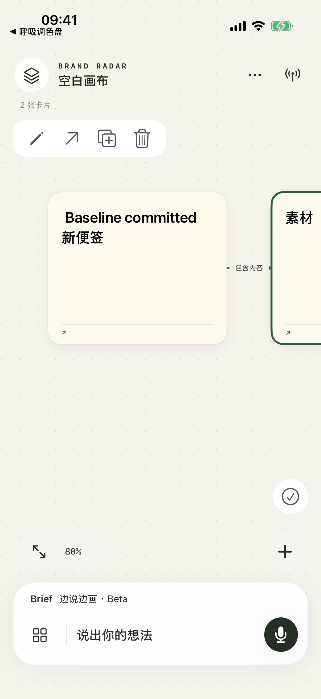
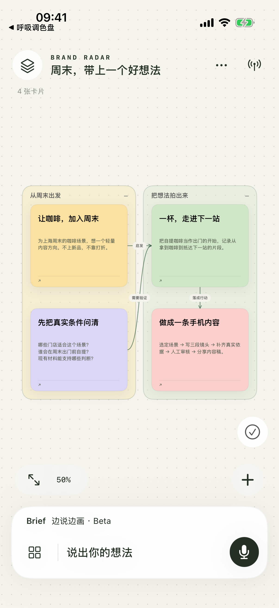
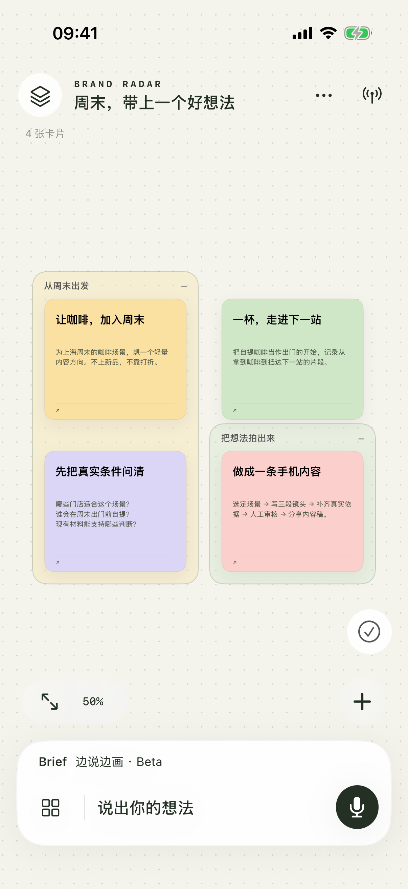
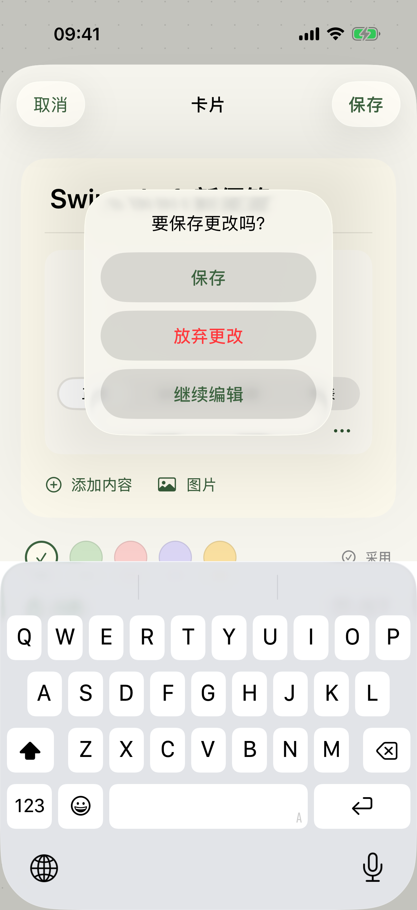
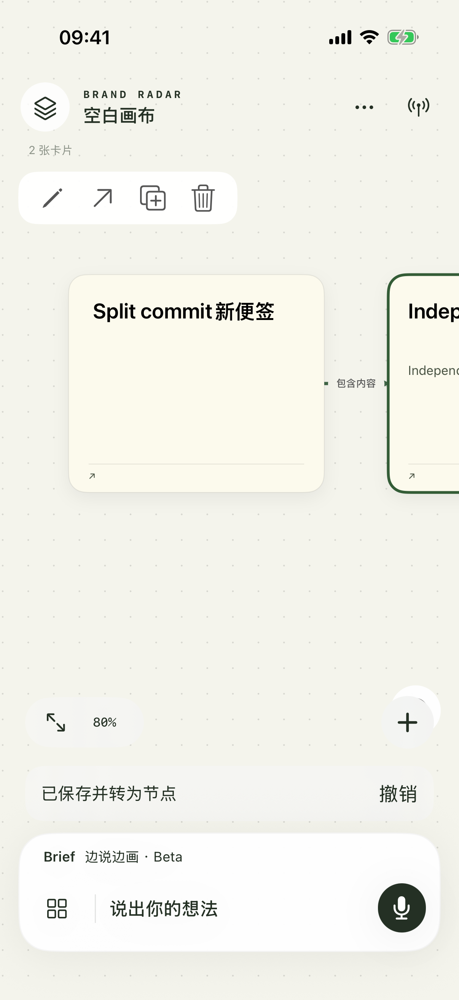
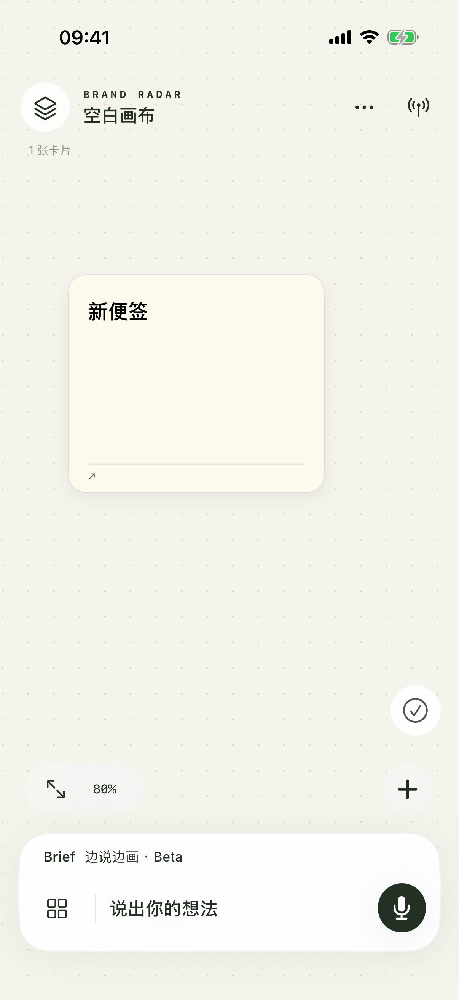
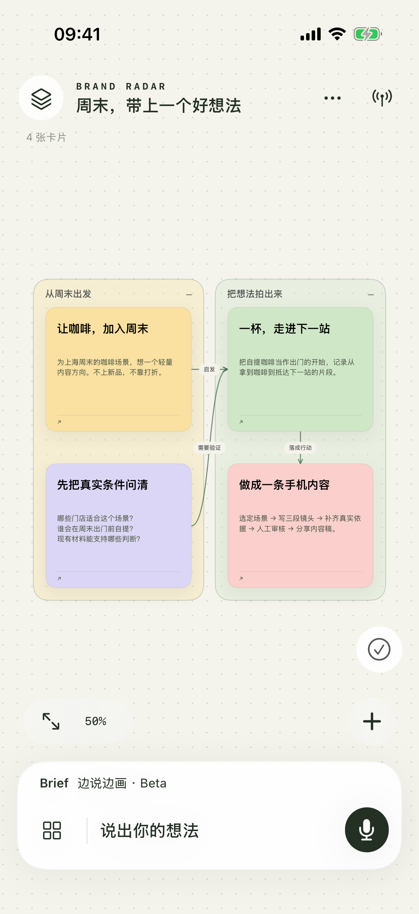
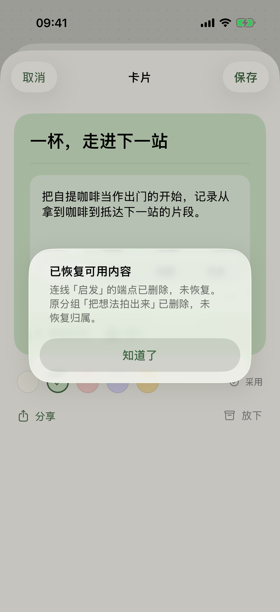

# 评议首轮执行记录

来源：`BrandRadar_Codex_Review_20260918.zip`；六份文档及 manifest 原样保存在 [原始任务包](BrandRadar_Codex_Review_20260918/00_START_HERE.md)，六份 SHA-256 均与 manifest 一致。

范围：B00、B01、B02。B03 之后未纳入本轮。

## B00：基线

- 源码：`6a3737d21a2a9e6776d3ad51088d29710e902267`，与评议基线一致。开始时源码无未提交修改。
- 环境：Xcode 26.6；iPhone 17 Pro 模拟器，iOS 26.5；测试均使用 `--uitesting` / `--uitesting-restore` 隔离文档与配置，不读取个人 Keychain。
- 真实复现一：编辑标题后拆为节点，编辑器仍有“取消”；点击取消后，标题修改与新增节点仍已保存。UI 测试 1/1 通过，表示旧缺陷已复现。
- 真实复现二：放下示例节点，重启后恢复，相关连线没有恢复、原组成员数从 2 变成 1。隔离基线源码 UI 测试 1/1 通过，表示旧缺陷已复现。
- 两次基线构建与 UI 测试结果分别位于 `outputs/ios-derived/Logs/Test/Test-BrandRadar-2026.09.18_15-56-59-+0800.xcresult` 与 `outputs/review-20260918/b00/derived/Logs/Test/Test-BrandRadar-2026.09.18_16-01-33-+0800.xcresult`。
- 调用：`xcodebuild -project ios/BrandRadar.xcodeproj -scheme BrandRadar -configuration Debug -destination 'platform=iOS Simulator,id=6A56C70C-1A1E-4FF6-9CCD-B78E260FDAE7' -parallel-testing-enabled NO -only-testing:BrandRadarUITests/EditorCommitUITests test`；归档复现使用同配置的隔离基线副本及 `ArchiveBaselineUITests`。
- 修正文档：Roadmap 的“没有 App 安装包”已更新为原生 iPhone 可构建安装、未公开分发。
- 未执行：真人真机交互、帧率、语音、模型调用与 Web 浏览器操作；不以旧版本测试替代。

### 基线截图

## B01：编辑与撤销

- 普通编辑保留本地草稿；取消与下滑退出显示“保存 / 放弃更改 / 继续编辑”。干净编辑器可直接关闭；“查看原素材”也遵循相同退出处理。
- “保存并转为节点”明确提示会保存草稿；保存与拆分一次提交，完成后关闭编辑器，画布提供本次撤销入口。
- 保存按字段及内容块合并，保留其他操作的修改；同字段、同块或顺序冲突拒绝整次保存并保留草稿。
- 修复拆分后的条件撤销：另一块被 Agent 修改时，仍能恢复拆出内容；被人修改过的目标节点、或原节点已删除时的目标内容，不被撤销抹掉。派生正文随块更新，独立旧正文仍保留。
- 沿用原有历史结构和稳定块 ID；新记录显式保留旧文字块，兼容已保存的旧历史。没有引入整板快照回滚或通用事务框架。

验证：A01—A04 的 5 项 UI 用例通过；模板编辑保存、混合内容保存重开、Beta 保留／放弃与重启的 4 项相关 UI 回归通过。真实 Store 层新增 26 个检查通过，含并发块编辑、源节点删除、单次撤销／重做与旧正文兼容。

运行采用 B00 的同一设备与隔离方式，`xcodebuild ... test` 选择 `EditorCommitUITests`、`BrandRadarUITests/testTemplateEditingAndPersistence`、`RichContentUITests`、`LiveDrawingUITests`。7/8 首轮中唯一剩余失败为测试同时匹配浮条与菜单的“撤销”；定点使用 `undoSplitButton` 后，拆分用例与上述 4 项回归最终 5/5 通过。最终构建产物及其检查为 B01+B02 联合工作树。

证据：`outputs/ios-derived/Logs/Test/Test-BrandRadar-2026.09.18_16-09-58-+0800.xcresult`（其余 7 项通过）；`Test-BrandRadar-2026.09.18_16-13-31-+0800.xcresult`（最终 5/5）。原生检查使用 `xcrun simctl launch --terminate-running-process 6A56C70C-1A1E-4FF6-9CCD-B78E260FDAE7 com.keyuanshi.brandradar --uitesting --canvas-selfcheck`；结果在 `outputs/review-20260918/final/canvas-checks.json`。

未执行：实体 iPhone 手势与 VoiceOver；模拟器通过不能替代这些验证。

## B02：放下与恢复

基于 B01 提交 `bf2d4f4`。新增可选的 `archiveRecord` 保存原采用状态、关联线与父组位置；手动放下及 API Agent 放下共用同一逻辑。恢复时只接回仍有效的对象，不覆盖人工改线、重新归组或已复用的 ID；相邻节点分批恢复、重复恢复、撤销／重做不会重复造线。已恢复的关系记录会消费，避免后来删线又被另一个归档快照复活。

这是本地 Codable 字段的向后兼容扩展，无存储迁移、无新服务协议。旧画布缺少该可选字段仍能读取；缺失旧恢复信息时保留内容并明确提示，不能推测旧连线。可编辑包包含该记录和原附件，仍排除连接凭据；旧 Mac 文字更新沿用原卡对象，保留该本地字段及其他内容块。

- A05—A07：3 项模拟器 UI 测试通过，包括放下后重启恢复、删除原端点／父组后的部分恢复及具体提示。
- A08 与边界：78 项归档／关系／条件撤销检查通过；9 项真实 Store 检查通过，包含 Agent 放下路径。
- 真实 `CanvasExport` 包往返：8 项检查通过，验证归档关系、分组、原采用状态和位置、附件原字节及导入后新路径。
- 全部原生自检：112 个检查入口通过（其中两项分别包含上述 78 项归档与 8 项附件包细分断言），覆盖旧文字卡、旧历史、富内容附件、布局缓存、口述与 Beta 撤回。原始结果保存于 [自检结果](20260918-native-checks.json)。
- Studio 兼容：`.venv/bin/python -u -m unittest discover -v -s tests -p 'test_studio*.py'`，26/26 通过。首次被默认 30 秒静默时限中止；详细运行确认本地 HTTP 测试正常耗时约 35 秒，采用 120 秒静默／180 秒总时限后完成。
- UI 总计：本轮 8 项目标场景与 4 项相关回归均通过。失败过的退出拦截和隐藏第三按钮已修正并重跑通过；测试选择器歧义也已修正。截图已打开检查。

独立归档逻辑命令：`xcrun swiftc -D ARCHIVE_CHECKS ios/BrandRadar/CanvasContent.swift ios/BrandRadar/CanvasEditing.swift ios/BrandRadar/CanvasArchiving.swift ios/BrandRadar/ArchiveChecks.swift -o /tmp/radar-archive-checks`，随后运行生成的检查程序。UI 调用同前，新增 `-only-testing:BrandRadarUITests/ArchiveRestoreUITests`。真实 iOS 自检使用最终 Debug 构建；没有用 Foundation fixture 替代原生模型验证。

未执行：实体 iPhone 安装／操作、真人语音、真机帧率、VoiceOver、真实云端模型调用、Mac 与手机在线同步及 Web 浏览器交互。自检中的渲染计时只说明模拟器离屏绘制，不代表真机触摸帧率。本轮不宣称这些项目通过，不扩展到 B03 之后。

## B03–B10：表达、阅读和接续

本轮按用户追加授权继续全部剩余批次，核心定位为“随心画板，AI 帮你落笔”。普通 Brief 听写进入可编辑草稿，Beta 继续流式成图与确认；无新增登录、外部 MCP 平台或 Hermes 操作。

- **B03/B04**：连续聊天不退出，卡片/递归组范围可见，运行期目标冻结；失效目标不得扩大成全板；草稿按画布保存。历史阅读不抢视角，新回复有入口。发现并修复第二轮相同回复在键盘收起、半屏面板缩小时没有补滚到底的问题，最终以“回复实际可见”验收。
- **B05/B07**：依实际屏幕字号显示轮廓/标题/预览，保留几何缓存和屏外剔除；显式阅读/继续改/编辑，完整混合内容阅读页，统一纸色、正文色与 44pt 画布工具点击范围。纸面主文/次文/操作色对比度检查通过。不是全应用 VoiceOver/Dynamic Type 人工认证。
- **B06**：变化提示取实际文档更新；定位与返回原处；条件撤回本轮保留之后人工字段、其他卡片以及后来引用新节点/分组的连线。无变化的演示不能借用之前的人工作业作为撤销目标。
- **B08/B09**：12 画布真实 UI 搜索标题、正文、空结果和返回；已放下归属当前画布；按嵌套分组导出完整 Markdown，含清单、表格、可追溯链接与摘录，排除归档、聊天、历史、连接配置和本机附件路径。
- **B10**：11 个隔离容量样本，实际 BoardStore 文件 IO、内容读取及保存后重开。仅合成附件、每样本一次；不把吞吐测量说成 FPS。

### 验证结果

最终原生检查 **144 项通过**，包含此前编辑/归档检查，以及 16 项工作闭环、6 项阅读/对比度、10 项 Markdown 验证。[原生结果](20260918-ux-native-checks.json)。本轮相关 **19 个不同 UI 用例最终通过**：归档 3、画布编辑/阅读 6、聊天/搜索 5、Beta 2、结果定位撤回 1、离线连续生成 1、原子拆分回归 1。

首轮 16 用例中只有旧“单卡删除”按钮定位因更多菜单改版失效；更新定位后通过。加强连续聊天断言后发现真实底部跟随问题，修复视口高度改变后补滚，保留向上阅读行为。对应结果包：17-24-02、17-28-39、17-30-51、17-32-43、17-34-18、17-35-20（`outputs/ios-derived/Logs/Test/`，失败过程与通过结果均保留）。最终滚动两用例通过包为 `Test-BrandRadar-2026.09.18_17-35-20-+0800.xcresult`。

容量环境：M4 Mac 上 iPhone 17 Pro 模拟器、iOS 26.5、Debug build 3。12 文档 × 30 节点/文档 × 1 附件/文档：打开约 **3.11 ms**，移动加保存 **3.13 ms**。50 文档 × 120 节点/文档 × 24 附件/文档：打开 **47.64 ms**，移动加保存 **48.12 ms**，再保存 **50.51 ms**；总数据 **44.27 MB**，其中合成附件 **39.32 MB**，文档等 **4.95 MB**。此样本读完后的进程 phys_footprint 约 **33.11 MB**，不是峰值或图片解码压力测试。[完整原始样本](20260918-capacity.json)。

真机当前调试隧道不可用。此轮没有重新测量真机 FPS、60–90 秒真人 ASR 或真实模型首节点延迟；这些仍是独立验收项。流畅度实现保留拖动中的本地几何更新、屏外剔除，新增按屏幕字号减少绘制细节，未重做画布引擎。
